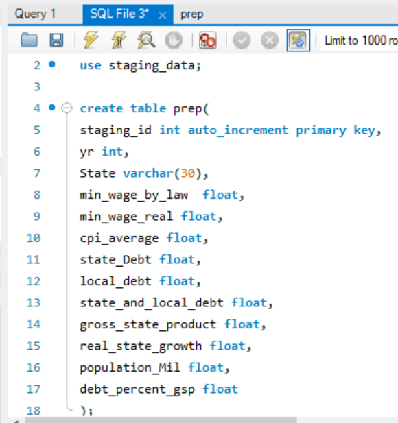
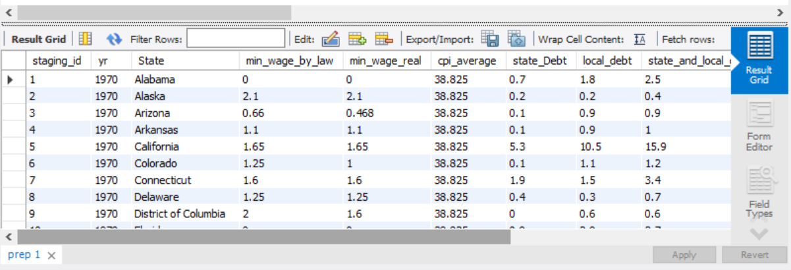

# Xiaojia-He

hi, i am a tiger to study, fighting!
to be confident, to be modest, to be curious.
The final project: Python, SQL, AWS, Tableau.
# Step1: Scraping the data from website by selenium

Reference:
Upload to S3: https://medium.com/@omarmoh.said/uploading-data-to-aws-s3-bucket-8be28d2efc63

How to use selenium: https://medium.com/@omarmoh.said/getting-gdp-data-using-selenium-acdd77cb1f17

How to visualize the data: https://medium.com/@omarmoh.said/quick-fix-on-choosing-the-right-visualization-chart-944278f80011

Move from python to mysql database: https://medium.com/@omarmoh.said/python-to-mysql-aws-cbc8aa38ef15 Roles:

# Step2: Clearn the data and merge the two csv together
Merge the data through an inner join

full = pd.merge(df1,df2,on=['State','Year'])

# Step3: create the staging schema: 

# Step4: Transfer the python dataframe data to mysql staging table

### the columns of staging schema should be the same with the dataframe columns

# Virtual environment preperation for lambda
You can prepare the virtual environment libraries through one of two ways

  1 create a Linux virtual environment on virtual box.
  
  2 Download the Packages from Pypi for linux.
  
  
https://youtu.be/ItE6MAZaiJY This video is good however it uses powershell instead of cmd, cmd was used here in the project instead and instead of activate.ps1 do activate.bat to create the virtual environement.

Creating the virtual environment with numpy,pandas....etc

Here is the link to tableau public

https://public.tableau.com/profile/sun.hee.park#!/vizhome/AnalyzingUSGSandMinWageData/Dashboard1
